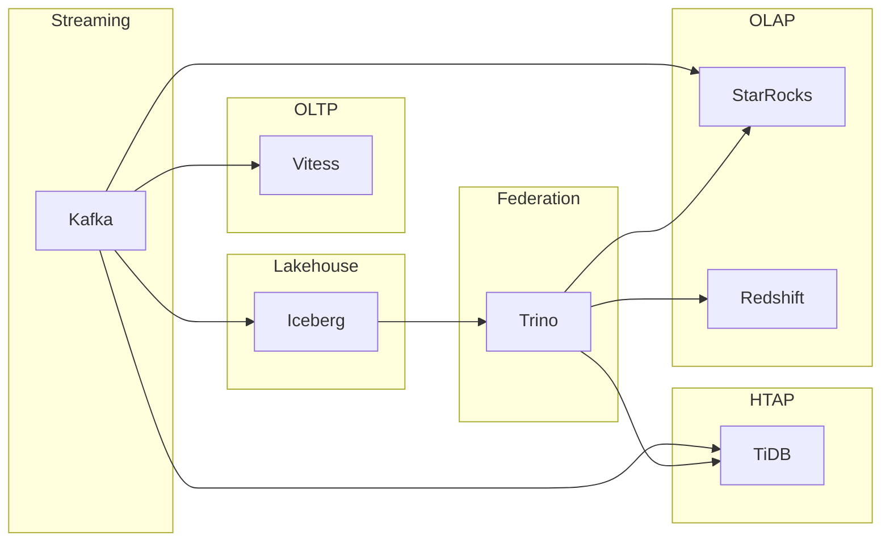

# Unified Lakehouse Engine

Cloud-native distributed analytics platform integrating **Kafka**, **TiDB**, **Vitess**, **Iceberg**, **Trino**, **Redshift**, and **StarRocks** for real-time streaming, scalable OLTP/OLAP, federated SQL, and lakehouse architectures.

This repository contains **application code only** — connectors, pipelines, query routing, and reference SQL. No Terraform or other infrastructure-as-code.

**Diagrams:** [docs/](docs/) — data flow, sequence diagrams, and data models (Mermaid).

## Architecture



| Workload | Engine | Use case |
|----------|--------|----------|
| Event streaming | Kafka | Real-time ingress |
| Sharded OLTP | Vitess | Horizontally scaled transactions |
| HTAP | TiDB | Mixed transactional + analytical serving |
| Lake storage | Iceberg | Open table format, time travel, ACID |
| Federated SQL | Trino | Cross-catalog joins |
| Real-time OLAP | StarRocks | Sub-second aggregates |
| Warehouse OLAP | Redshift | Petabyte-scale analytics |

## Quick start

```bash
python -m venv .venv
.venv\Scripts\activate          # Windows
pip install -e ".[dev]"

# Copy and edit endpoints for your clusters
copy config\platform.example.yaml platform.yaml

# Health check (requires running services)
lakehouse -c platform.yaml health

# Publish sample events
lakehouse -c platform.yaml publish events.raw -f examples/sample_events.json

# Run streaming pipeline
lakehouse -c platform.yaml stream --topic events.raw

# Incremental lakehouse sync
lakehouse -c platform.yaml sync --since 2026-05-25T00:00:00Z

# Federated query via Trino
lakehouse -c platform.yaml query "SELECT COUNT(*) FROM events" --workload lakehouse
```

## CLI vs library

| Layer | File | Role |
|-------|------|------|
| **Library** | `engine.py` | Business logic: connectors, pipelines, query routing |
| **CLI** | `cli.py` | Thin terminal wrapper; registers as the `lakehouse` command |

`cli.py` does **not** implement analytics itself. It parses flags, builds `LakehouseEngine`, calls one operation, and prints JSON or status. Use the CLI for ops and debugging; import `LakehouseEngine` in apps and notebooks.

## Project layout

```
docs/               # Data flow, sequence diagrams, data models (Mermaid)
src/lakehouse/
  connectors/     # Kafka, TiDB, Vitess, Iceberg, Trino, Redshift, StarRocks
  pipelines/      # Streaming + lakehouse sync
  query/          # Workload-aware SQL routing
  engine.py       # Orchestration entry point (use this in code)
  cli.py          # `lakehouse` command (optional ops interface)
config/           # Example YAML configuration
sql/              # Reference DDL and Trino catalog properties
examples/         # Sample event payloads
tests/
```

## Python API

```python
from lakehouse import LakehouseEngine
from lakehouse.query.federation import WorkloadType

engine = LakehouseEngine.from_yaml("platform.yaml")
engine.connect_all()

engine.publish_event("events.raw", {"event_id": "e-1", "event_type": "click"})
engine.streaming_pipeline().run()

result = engine.query(
    "SELECT event_type, COUNT(*) FROM events GROUP BY 1",
    WorkloadType.OLAP_REALTIME,
)

engine.close_all()
```

## Configuration

Set cluster endpoints in `platform.yaml` (see `config/platform.example.yaml`). Environment overrides use the `LAKEHOUSE_` prefix with nested `__` delimiters.

Apply table DDL from `sql/schemas/init.sql` on each engine. Mount Trino catalog definitions from `sql/trino/catalogs.properties` on your Trino coordinator.

## License

MIT
