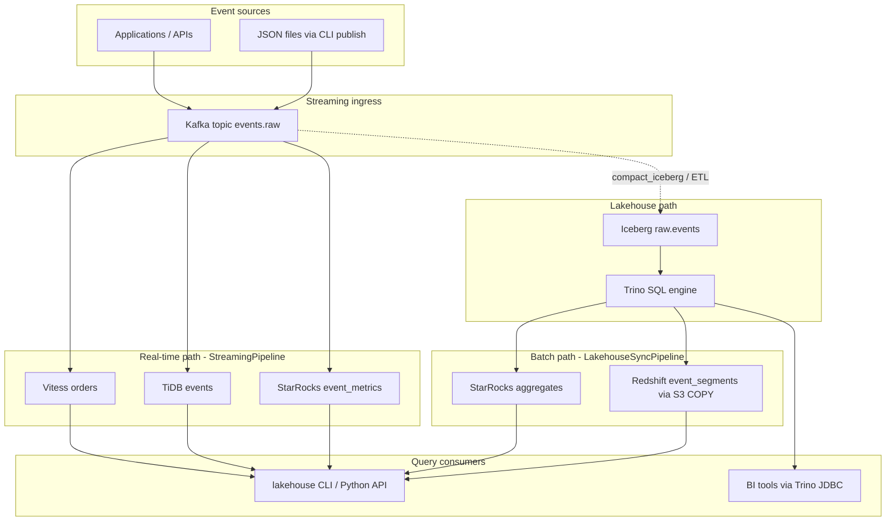
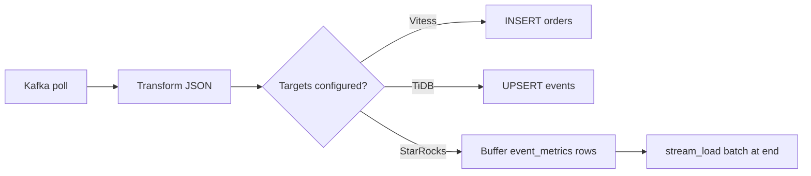
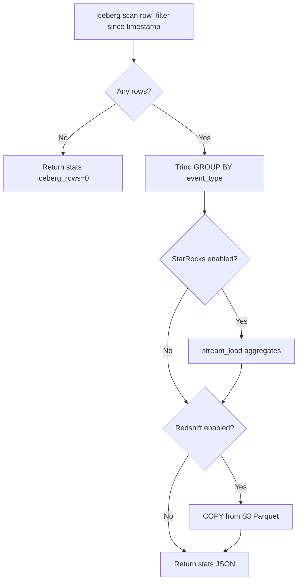
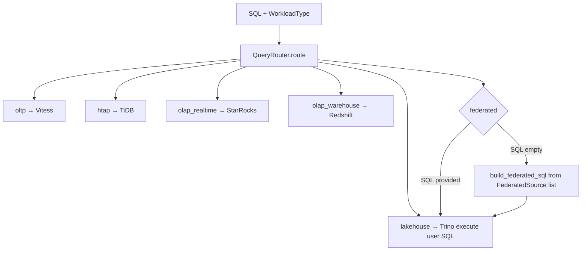
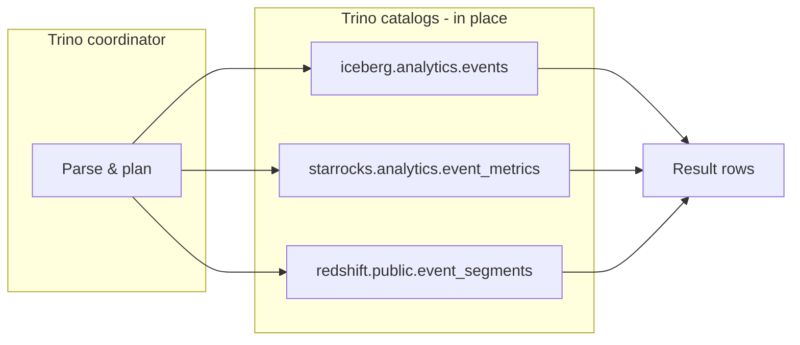
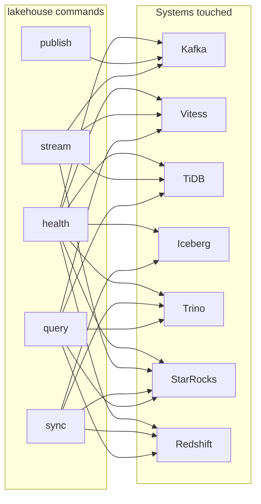

# Data flow diagrams

How data moves through the platform: ingress, real-time fan-out, batch lakehouse sync, and query paths.

## Platform overview

## Real-time streaming flow

Triggered by `lakehouse stream` or `StreamingPipeline.run()`.

| Step | Component | Output |
|------|-----------|--------|
| 1 | `KafkaConnector.consume` | Parsed event dict |
| 2 | `_default_transform` | Canonical `event_id`, `event_type`, `occurred_at`, … |
| 3 | Vitess | Row in `orders` |
| 4 | TiDB | Row in `events` (upsert on `event_id`) |
| 5 | StarRocks | Rows in `event_metrics` (batched insert) |

## Lakehouse batch sync flow

Triggered by `lakehouse sync --since <timestamp>` or `LakehouseSyncPipeline.run_incremental()`.

## Query / workload routing

| Workload | Data accessed | Typical use |
|----------|---------------|-------------|
| `oltp` | Vitess `commerce.orders` | Point writes / transactional reads |
| `htap` | TiDB `analytics.events` | Serving layer, mixed workloads |
| `olap_realtime` | StarRocks `event_metrics` | Dashboards, low latency |
| `olap_warehouse` | Redshift `event_segments` | Large historical analytics |
| `lakehouse` | Trino → Iceberg (single catalog) | Lake SQL, audits |
| `federated` | Trino → 1..N catalogs | Cross-engine joins |

## Federated query data flow

Trino reads remote catalogs without copying all data into one store first. Join keys (default `event_id`) align rows across systems.

## CLI command → data touchpoints

`publish` only connects to Kafka. `health` probes all connectors. `stream` / `sync` / `query` touch subsets per workload.
