# Data models

Schemas for inbound events, per-engine tables, lakehouse storage, configuration, and how they relate.

## Canonical event (Kafka / pipeline)

Events on `events.raw` are JSON. The streaming pipeline normalizes them to this shape.

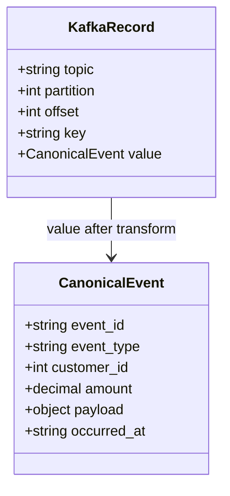

| Field | Type | Required | Notes |
|-------|------|----------|-------|
| `event_id` | string | yes | From `event_id` or fallback `id` |
| `event_type` | string | yes | e.g. `order.placed`; default `unknown` |
| `customer_id` | int | no | Used for Vitess `orders` |
| `amount` | number | no | Default `0`; mapped to StarRocks `metric_value` |
| `payload` | object | no | Stored as JSON string in TiDB / Iceberg |
| `occurred_at` | ISO-8601 string | yes | UTC if omitted |

**Source example:** [`../examples/sample_events.json`](../examples/sample_events.json)

---

## Logical entity relationship (cross-system)

`event_id` is the global correlation key across stores.

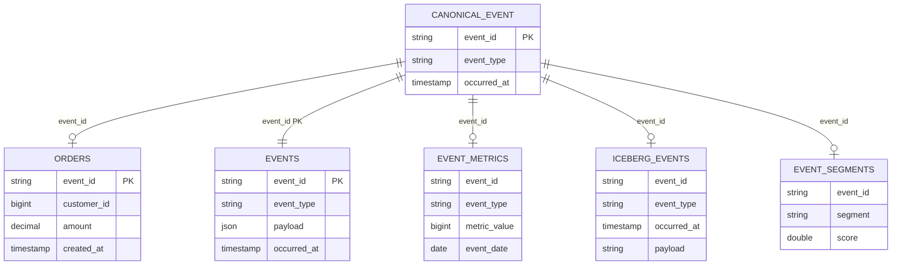

---

## Per-engine physical models

### Vitess — `commerce.orders` (OLTP)

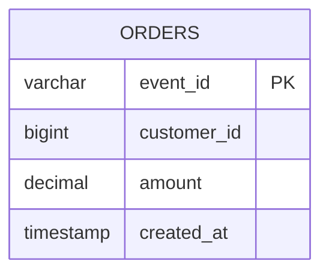

Sharding: Vitess VSchema routes by shard key (see `VitessConnector.route_by_shard_key`).

---

### TiDB — `analytics.events` (HTAP)

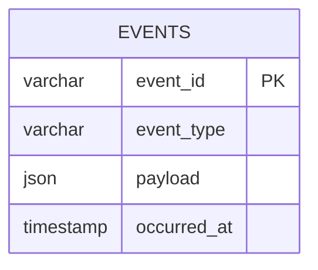

Writes use `ON DUPLICATE KEY UPDATE` (upsert) on `event_id`.

---

### StarRocks — `analytics.event_metrics` (real-time OLAP)

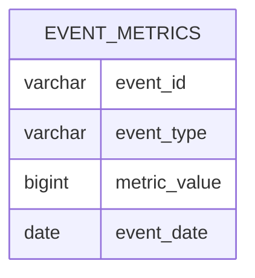

`DUPLICATE KEY(event_id)` — columnar aggregate-friendly layout.

---

### Iceberg — `raw.events` (lakehouse)

Namespace and table from config (`iceberg.namespace`, `iceberg.table`).

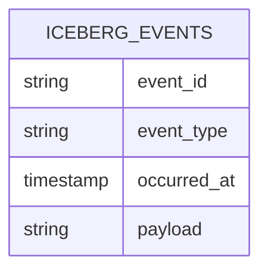

| Column | Arrow type | Notes |
|--------|------------|-------|
| `event_id` | string | Join key |
| `event_type` | string | Partition / filter candidate |
| `occurred_at` | timestamp(us) | Incremental sync filter |
| `payload` | string | JSON serialized |

Warehouse path: `s3://…` from `iceberg.warehouse` in config.

---

### Redshift — `public.event_segments` (warehouse)

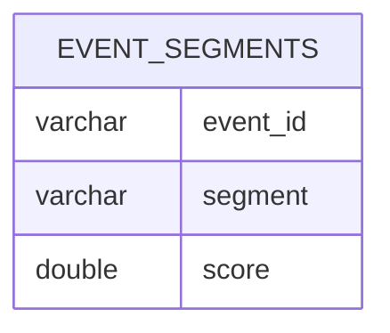

Loaded via `COPY … FROM s3://… FORMAT AS PARQUET` in batch sync.

---

## Federated query model (Trino)

Trino does not own the data; it exposes **catalog.schema.table** over remote systems.

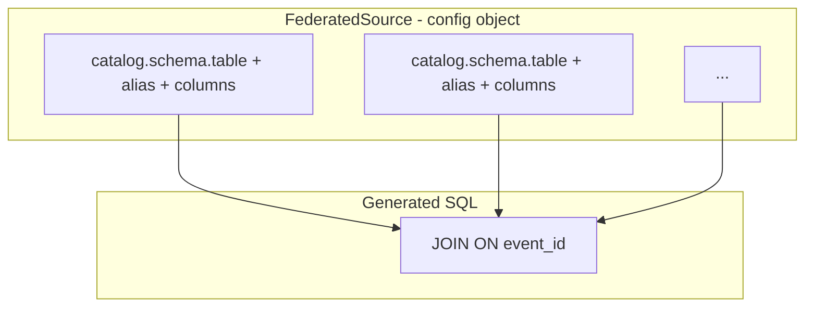

Default three-source join (when SQL not provided):

| Alias | Fully qualified table | Selected columns |
|-------|----------------------|------------------|
| `i` | `iceberg.analytics.events` | `event_id`, `event_type` |
| `s` | `starrocks.analytics.event_metrics` | `event_id`, `metric_value` |
| `r` | `redshift.public.event_segments` | `event_id`, `segment` |

Single-source query: one `FederatedSource` → `SELECT … FROM catalog.schema.table` (no join).

---

## Platform configuration model

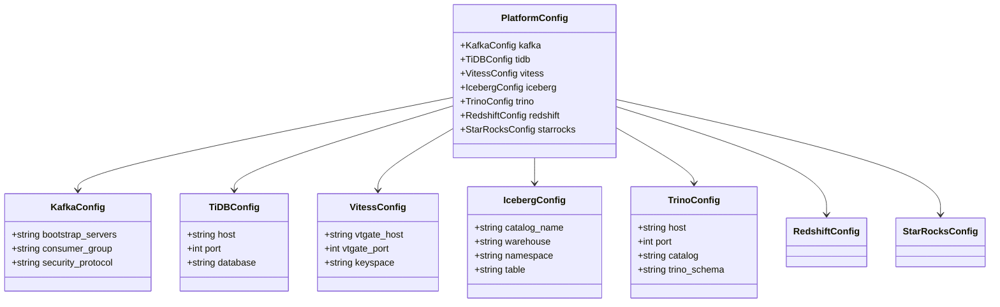

Loaded from `platform.yaml` via `load_config()` → `LakehouseEngine.from_yaml()`.

---

## Query result model (API)

All SQL connectors return the same structure to callers.

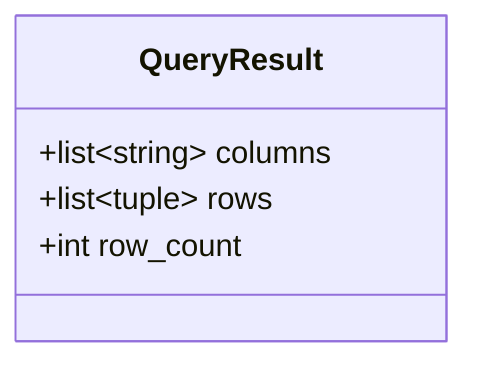

Used by `QueryRouter`, `lakehouse query` JSON output, and library callers.

---

## Workload type → store mapping

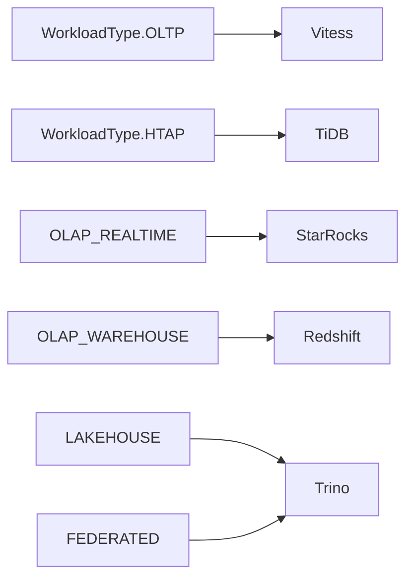

---

## DDL reference

Physical `CREATE TABLE` statements: [`../sql/schemas/init.sql`](../sql/schemas/init.sql)

Trino catalog wiring: [`../sql/trino/catalogs.properties`](../sql/trino/catalogs.properties)
