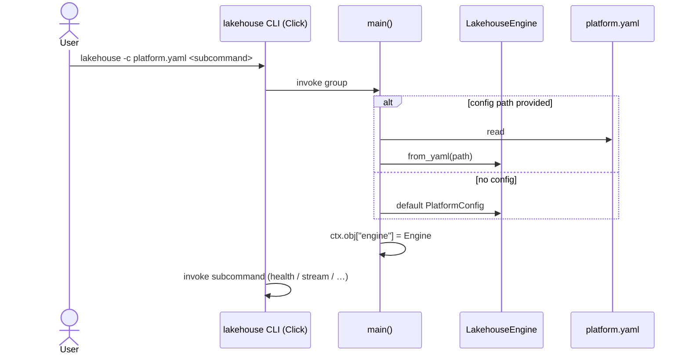
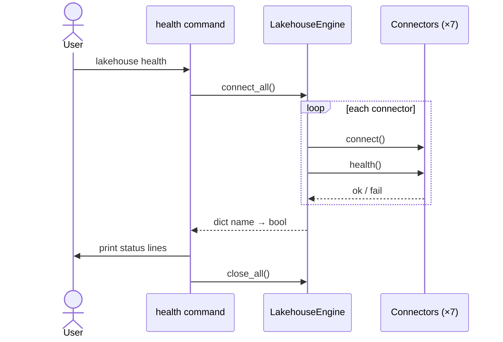
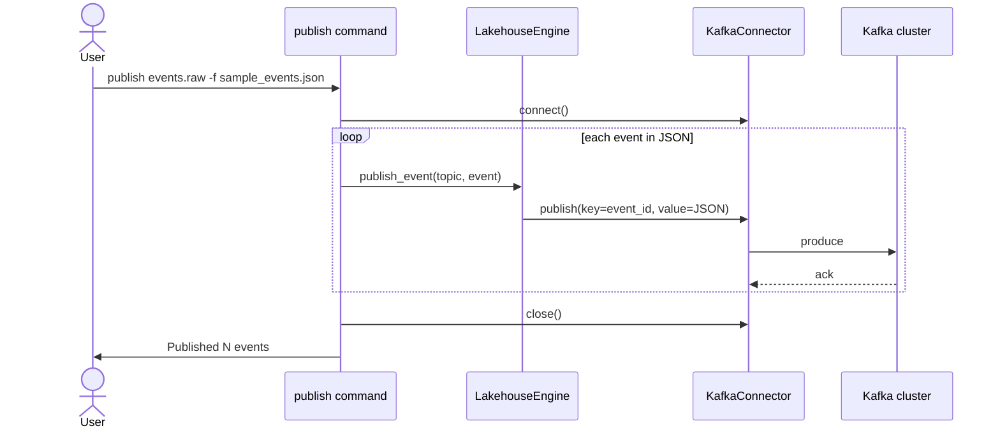
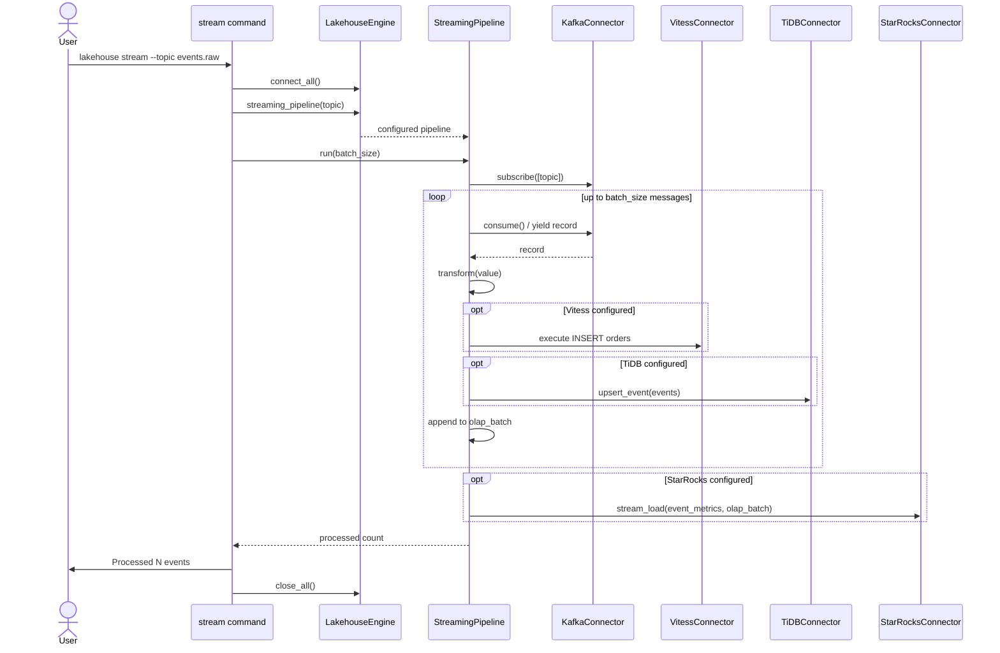
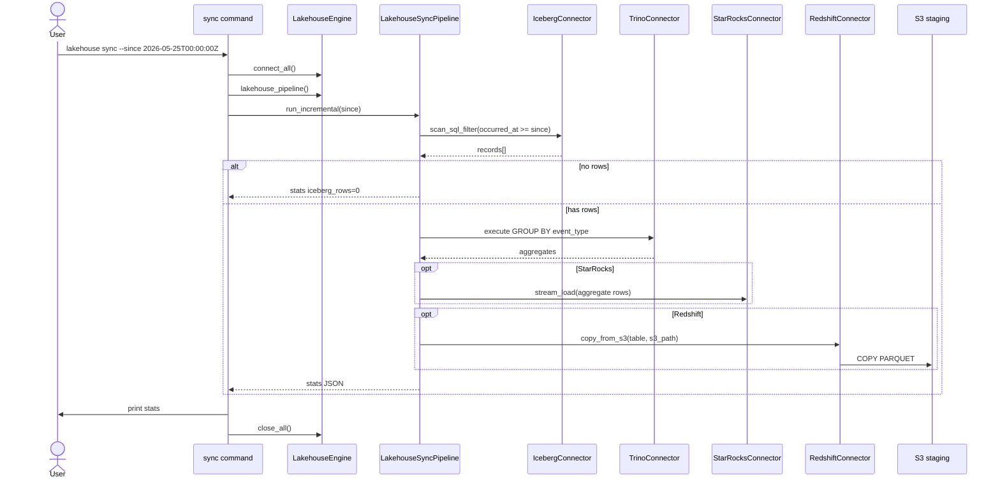
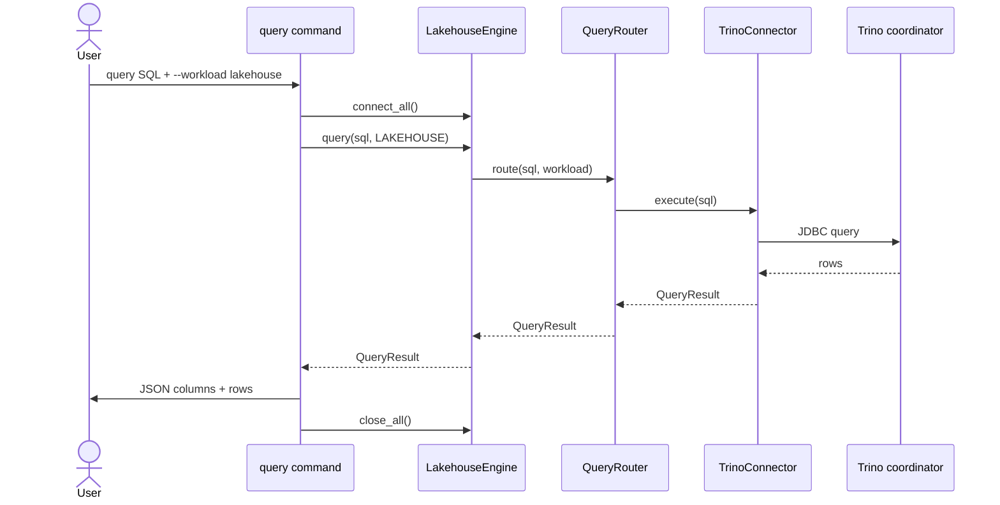
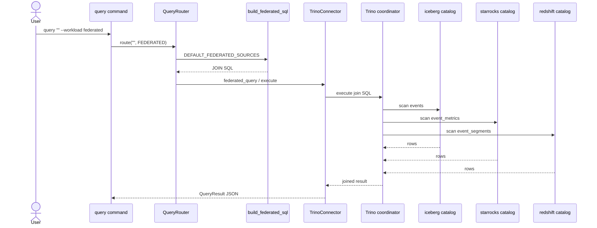
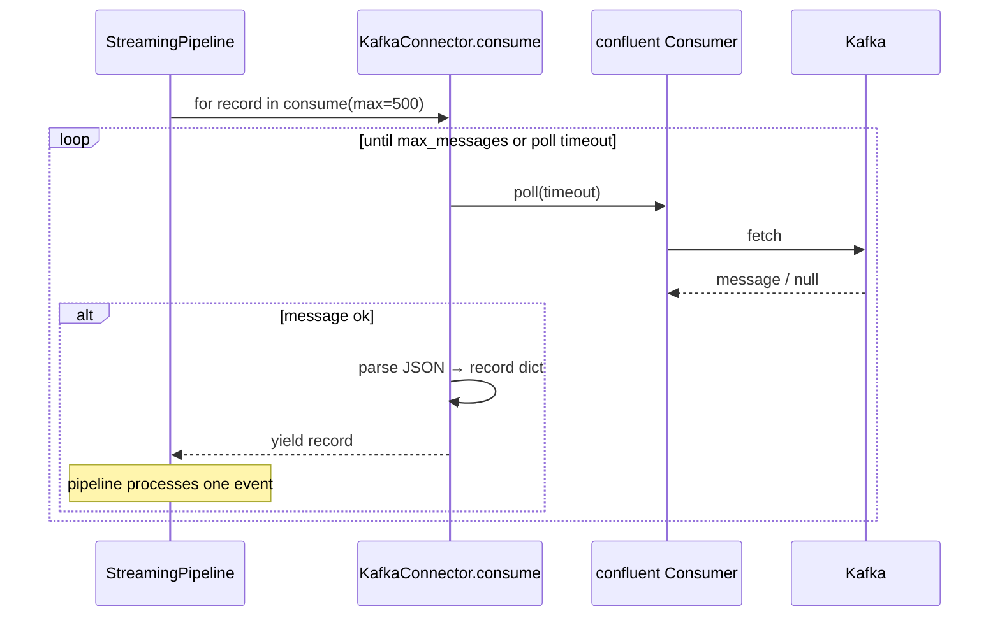
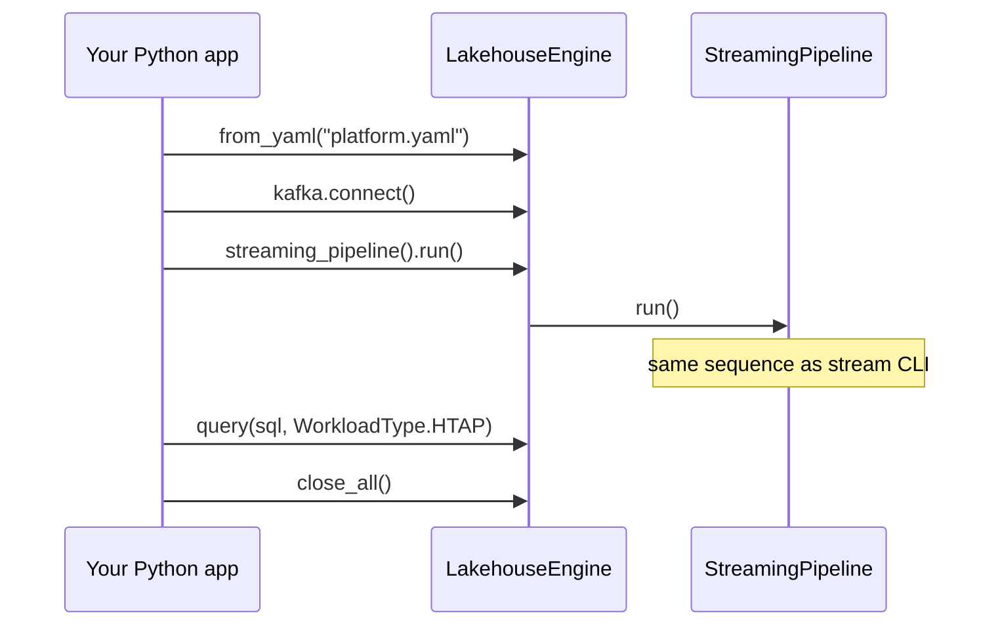

# Sequence diagrams

Interaction order between operators, the Python engine, and external systems.

## CLI startup (shared context)

Every subcommand runs the Click group first, then the subcommand.

## Health check

## Publish events to Kafka

## Real-time streaming pipeline

## Lakehouse incremental sync

## Query routing (single workload)

Example: `lakehouse query "SELECT COUNT(*) FROM events" --workload lakehouse`

## Federated query (multi-catalog)

When `--workload federated` is used with **empty** SQL, the engine builds SQL from `FederatedSource` list.

When the user **provides SQL**, `route` skips `build_federated_sql` and sends SQL directly to Trino.

## Kafka consume generator (library detail)

`yield` pauses the generator until the caller asks for the next record.

## Application API (without CLI)

